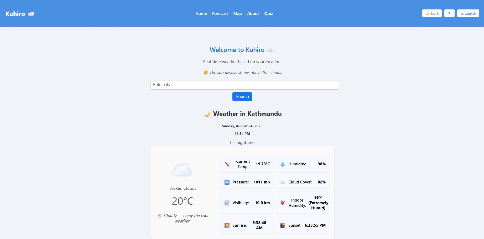
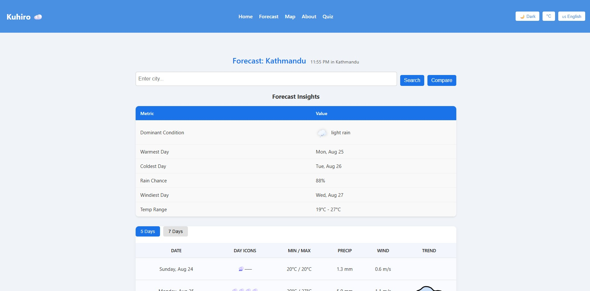
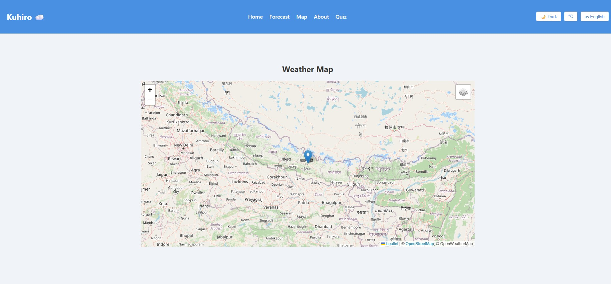
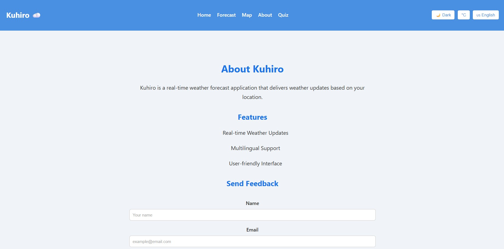
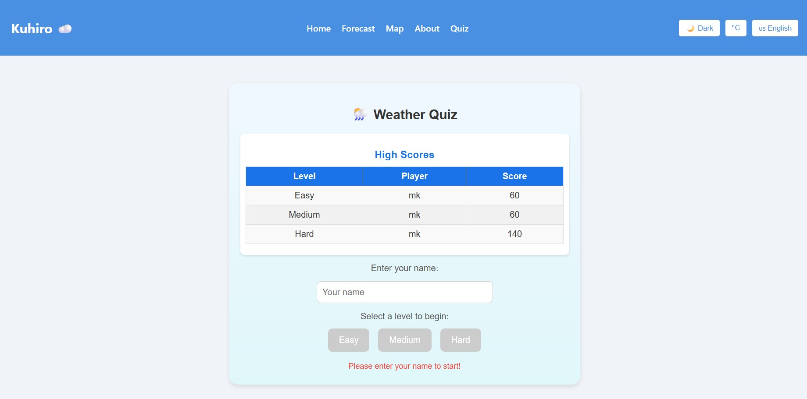

# 🌤️ कुहिरो (Kuhiro) — Real-Time Global Weather Forecast Web Application

> **"Weather at your fingertips, anywhere in the world."**  
> _A modern, responsive, multilingual weather app built with React.js, TypeScript, and Django REST Framework._

---

## 📊 Badges


---

## 📖 About the Project

**Kuhiro** (_कुहिरो_) is a **real-time global weather forecast web application** designed to provide accurate weather data with an elegant and user-friendly interface.  
It supports **multilingual functionality**, **offline mode**, and **animated weather icons**, ensuring a seamless experience across devices. The app also includes an engaging **Weather Quiz Game** to test users' knowledge with dynamic levels and leaderboard integration.

---

## ✨ Features

- 🌍 **Real-Time Global Weather Updates**
- 🌐 **Multilingual Support** (English, Nepali)
- 🌡 **Unit Toggle** — °C ↔ °F
- 📅 **Multi-Day Forecast** with clean table layout
- 📍 **Auto Location Detection** & Last Searched City Memory
- 📜 **Search History** with clickable past searches
- 🔍 **City Autocomplete Suggestions**
- 📶 **Offline Support** — Cached weather & forecast data
- 🗺 **Interactive Weather Map** with overlays (Clouds, Rain, Temperature, Pressure, Wind)
- 🎨 **Theme Friendly** (Light/Dark)
- 💬 **Feedback Form** connected to **custom Django API**
- ⚡ **Responsive & Accessible Design**
- 🎮 **Weather Quiz Game**:
  - Three difficulty levels: Easy (5 points/question), Medium (10 points), Hard (20 points)
  - 10–20 questions per level with 4 answer options

---

## 🛠 Tech Stack

### **Frontend**
- [React.js](https://reactjs.org/) + [TypeScript](https://www.typescriptlang.org/)
- [Vite](https://vitejs.dev/) for blazing-fast builds
- [Leaflet.js](https://leafletjs.com/) for interactive maps
- CSS Modules for scoped styling

### **Backend**
- [Django](https://www.djangoproject.com/) + [Django REST Framework](https://www.django-rest-framework.org/)
- Custom REST APIs for weather & feedback
- [SQLite](https://www.sqlite.org/) database (development) — can be upgraded to PostgreSQL/MySQL

### **APIs & Services**
- [OpenWeatherMap API](https://openweathermap.org/api) for weather data
- Custom Django endpoints for feedback storage & retrieval

---
## 🎥 Project Preview

> **Kuhiro in Action**

  

---

## 📂 Project Structure
```yaml
kuhiro-weather-app/
│
├── backend/ # Django backend
│ ├── backend_project/ # Main Django project settings
│ ├── weather_api/ # Weather & feedback API app
│ ├── manage.py
│ └── db.sqlite3
│
├── frontend/ # React + TypeScript frontend
│ ├── src/
│ │ ├── components/
│ │ ├── pages/
│ │ ├── context/
│ │ ├── assets/
│ │ └── App.tsx
│ └── vite.config.ts
│
└── README.md
```
---

## ⚙️ Installation & Setup

### **Prerequisites**
- Node.js (>= 18)
- Python (>= 3.10)
- pip & virtualenv

---

### **Backend Setup (Django API)**
```bash
# Go to backend folder
cd backend

# Create & activate virtual environment
python -m venv env
env\Scripts\activate         # Windows
# source env/bin/activate    # Mac/Linux

# Install dependencies
pip install -r requirements.txt

# Apply migrations
python manage.py migrate

# Start server
python manage.py runserver
```
Backend will start at: http://localhost:8000/

### Frontend Setup (React + Vite)
```bash
# Go to frontend folder
cd frontend

# Install dependencies
npm install

# Start dev server
npm run dev

```
Frontend will start at: http://localhost:5173/

## 📡 API Endpoints
```yaml

GET  /api/weather/         # Get current weather
GET  /api/forecast/        # Get 5-day forecast
POST /api/feedback/        # Submit feedback
GET  /api/feedback/        # Fetch all feedback
GET  /api/quiz/<level>/    # Fetch quiz questions by level (easy, medium, hard)
POST /api/quiz/submit/     # Submit quiz score
GET  /api/quiz/leaderboard/ # Fetch top scores by level
```
---
# 📸 Screenshots






---
## 👨‍💻 Contributors
```yaml

- name: Mridul Khanal
  role: Lead Developer
  github: https://github.com/Mridulkhanal

- name: OpenWeatherMap
  role: API Provider
  website: https://openweathermap.org
  
```
## 🧠 Development Philosophy
```txt

Origin: Started as a simple weather viewer for my location.
Growth: Expanded into a multi-feature global forecast tool with an interactive quiz game.
Mission: Make weather information and learning clear, accessible, and engaging.
I believe in code that scales with purpose — clean, efficient, and impactful.

```


